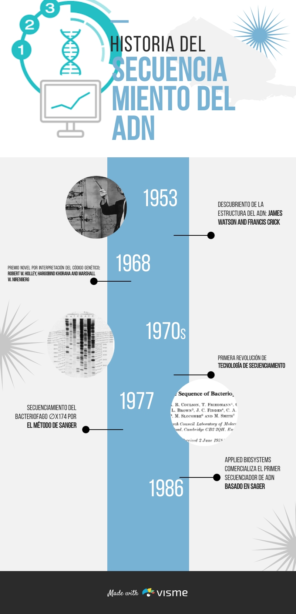

# Introducción a tecnologías de Next Generation Sequencing (NGS)
Familarizarse con las diferentes tecnologías de Next Generation Sequencing 

# Instructor 👩‍🏫  
Thalía Araceli Silvestre Espejo 

Yo amo 🎤, 💃 and ☕


# Breve historia de la secuenciación del ADN
Resaltar hechos importantes antes de la comercialización de tecnologías de Next Generation Sequencing (NGS) en una línea de tiempo

<p align="center">


# Tecnologías de Next Generation Sequencing

```
Describe colectivamente los enfoques de secuenciación que han reducido el tiempo y el costo y han aumentado enormemente la producción de la secuencia en comparación con la secuenciación de Sanger. 
Tecnologías de secuenciación de alto rendimiento.
```
* NGS se caracteriza por realizar de millones a miles de millones de reacciones de secuenciación individuales simultáneamente en un proceso denominado secuenciación masivamente paralela.

* El enfoque ha revolucionado la secuenciación del ADN hasta el punto de que ahora se puede secuenciar un genoma humano completo en 3 días por alrededor de 1.000 dólares

 La siguiente figura representa la reducción de costo de secuenciamiento por megabases hasta agosto del 2020 de acuerdo a *National Human Genome
Research Institute (NHGRI)*
<p align="center">

 
 # Tecnologías de la segunda generación
 
```
Se describe como tecnologías de short-reads
```
* 454
 ```
  Esta tecnología está basada en el método de secuenciamiento por síntesis que involucra una combinación de PCR en emulsión y el pirosecuenciamiento
  ```
  2005 ➡️ Secuenciamiento y ensamblaje de *novo* del genoma de *Mycoplasma genitalium* con 96% de cobertura y 99,96% de presición en un corrida
  
 El pirosecuenciamiento se realiza usando una sola hebra de ADN de la muestra, cebador, enzima polimerasa, ATP sulfurilasa, luciferasa y apirasa como se muestra  en la siguiente figura. 

<p align="center">

 
 
 
